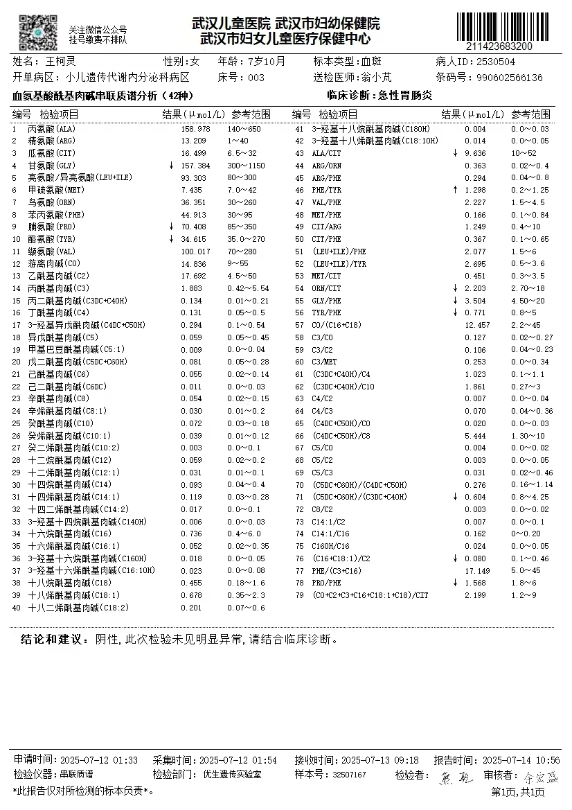
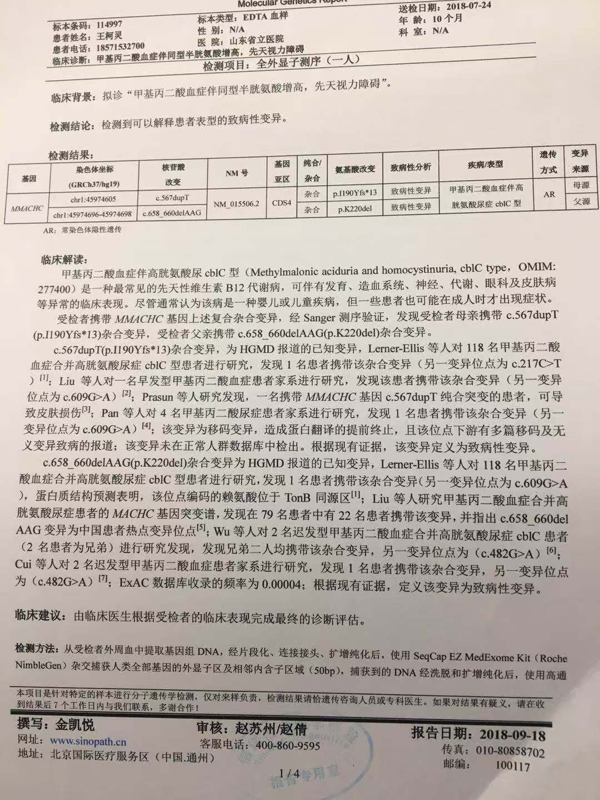

**王柯灵小朋友病情摘要（供新医生参考）**
*整理日期：2026年3月22日*

**一、 核心提示**
- **主要问题：** 甲基丙二酸血症（合并型）伴高同型半胱氨酸血症，继发癫痫。
- **当前状态：** 病情相对稳定，长期坚持药物治疗。2026年3月22日再次癫痫发作，发作后伴明显呕吐，已住院处理。

**二、 基本信息**
- 姓名：王柯灵
- 性别：女
- 出生日期：2017年09月19日 (8岁)
- 体重： 15kg

**三、 主要诊断**
1.  **甲基丙二酸血症（合并型）伴高同型半胱氨酸血症**
    - 确诊时间：2018年5月
2.  **癫痫**（考虑为代谢病继发）
    - 确诊时间：2021年3月
    - 整体情况：
      - 一开始使用左乙拉西坦口服液完全控制不住。后续加了妥泰（托吡酯）之后控制了1年半左右没有发作。
      - 然后再次发作，加用拉考沙胺口服液，控制了半年左右。
    - **近期发作情况：**
      - 2025年8月，发作一次后调整了拉考沙胺的剂量，3ml -> 4ml。
      - 2025年11月，发作一次之后开始加用吡仑帕奈，0.5片每晚，同时开始对左乙拉西坦减药，每周减少1ml，计划6周减完。
      - 2025年11月，再次发作后吡仑帕奈加用到1片每晚。
      - 2025年12月29日，发作后吡仑帕奈加到了1.5片每晚，同时左乙拉西坦完全减完。
      - 2026年2月23日，中午3点前睡醒前再次大发作。发作约2分钟后使用地西泮，1分钟后控制住。之后将吡仑帕奈加到2片每晚，同时加用甜菜碱，不严格按2mg/天服用（偶尔用，偶尔没用）。
      - 2026年3月22日，中午1点45分再次发作。开始表现为手指抽动，持续约2分钟，中间暂停约3分钟，随后手抽动并联动头部摆动约1分钟后自行恢复，之后仍使用了地西泮。发作后伴明显呕吐，当日住院；住院后将妥泰调整为早晚各2片。

**四、 目前治疗方案**
*以下方案按2026年3月22日住院时的当前用药情况整理。后续如有调药，请结合“近期发作情况”中的时间轴一起看。*
- **代谢病治疗：**
    - 羟钴胺：16mg 肌肉注射 / 每3天一次
    - 左卡尼汀口服液：15ml / 天
    - 亚叶酸钙：7.5mg / 天
    - 甜菜碱：2mg / 天（医生要求规律服用；目前实际执行不严格，偶尔漏用）
- **抗癫痫治疗：**
    - 妥泰（托吡酯）：早晚各2片
    - 拉考沙胺口服液：4ml/次，每日两次
    - 吡仑帕奈：2片 / 每晚

**五、 重要历史与长期参考结果**
- **基因点位**
    c.567dupT，c.658-660delAAG 具体看详细报告
- **既往代谢指标（2023年7月12日）：**
    - 同型半胱氨酸：**38.15 µmol/L** (偏高)
    - 血氨基酸酰基肉碱谱：C3: 1.883, C3/C2: 0.106, C0: 14.836。
- **近年随访提示：**
    - 同型半胱氨酸在后续复查中仍偏高，但较前有下降趋势。
    - 吡仑帕奈血药浓度在调整剂量后已进入参考范围。
    - 2026年3月22日这次发作后，住院期间仍持续呕吐一下午，约8次；医生建议后续如癫痫再发作并伴明显呕吐，可按医嘱尝试昂丹司琼舌下含服止吐。
- **既往急性发作诱因：**
    - 癫痫发作后呕吐
    - 感染（尤其肠胃炎）
- **生长发育与营养：**
    - 目前饮食：正常饮食，无特殊严格限制，每餐约300g。

**六、 过敏史与不良反应**
- 药物/食物过敏史：**无**
- 环境过敏：霉菌过敏（吸入性）。

**七、 既往主要就诊信息**
- 医院：武汉市儿童医院
- 科室：遗传代谢内分泌科

**八、 补充资料**
- 2026年3月22日本次住院资料详见：[2026-03-22住院整理.md](./检查报告/20260322住院/2026-03-22住院整理.md)

